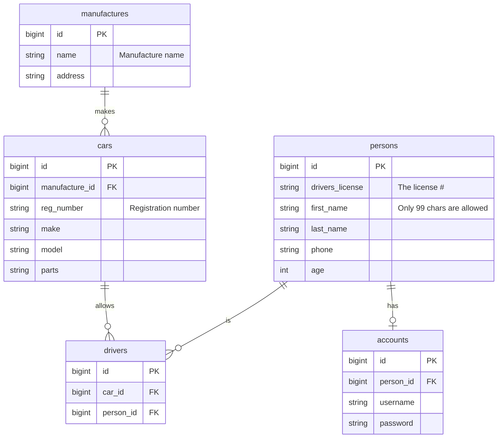

# Drawing Diagram Using MermaidJS

## Video Explanation in Bahasa

1. <https://youtu.be/Ldwdo2MqUR0>

## ERD

```mermaid
erDiagram

  manufactures ||--o{ cars : makes
  cars ||--o{ drivers : allows
  persons ||--o{ drivers : is
  persons ||--o| accounts : has

  manufactures {
    bigint id PK
    string name "Manufacture name"
    string address
  }

  cars {
    bigint id PK
    bigint manufacture_id FK
    string reg_number "Registration number"
    string make
    string model
    string parts
  }

  persons {
    bigint id PK
    string drivers_license "The license #"
    string first_name "Only 99 chars are allowed"
    string last_name
    string phone
    int    age
  }

  accounts {
    bigint id PK
    bigint person_id FK
    string username
    string password
  }

  drivers {
    bigint id PK
    bigint car_id FK
    bigint person_id FK
  }
```

## References

1. <https://mermaid.js.org/syntax/entityRelationshipDiagram.html>
